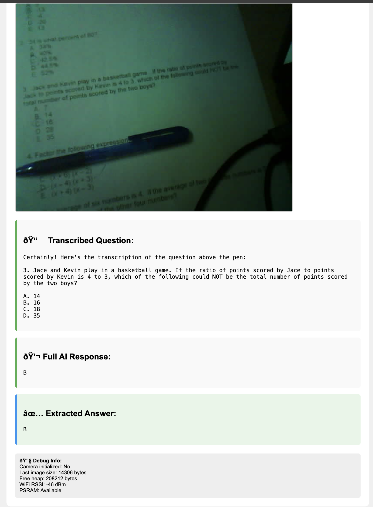

# ESP32 OCR Camera System

An ESP32-CAM based system that captures images, transcribes questions using OCR, and provides AI-powered answers via OpenAI's GPT-4o Vision API. As seen on Reddit:
[link](https://www.reddit.com/r/ChatGPT/comments/1kw1iiz/this_kid_used_a_5_board_to_get_o3_on_his/) and explanation post 
[link](https://www.reddit.com/r/ChatGPT/comments/1kwgu9i/follow_up_is_it_possible_to_make_the_cheating/)

<p align="center">
  
</p>

## Features

- 📸 **Image Capture**: High-quality JPEG image capture via ESP32-CAM
- 🔍 **OCR Transcription**: Extracts text/questions from images using AI vision
- 🤖 **AI Answers**: Provides detailed answers to transcribed questions
- 🌐 **Web Interface**: Easy-to-use web dashboard for image capture and results
- 📱 **Serial Commands**: Control via Serial Monitor for debugging

## Hardware Requirements

- **ESP32-CAM** (AI-Thinker model recommended)
- **FTDI Programmer** or **ESP32-CAM-MB** programmer board

## Wiring (if using FTDI programmer)

| ESP32-CAM | FTDI |
|-----------|------|
| 5V        | 5V   |
| GND       | GND  |
| U0R       | TX   |
| U0T       | RX   |
| IO0       | GND (for programming mode) |

## Software Requirements

### Arduino IDE Setup

1. **Install ESP32 Board Package**:
   - Open Arduino IDE
   - Go to `File` → `Preferences`
   - Add this URL to "Additional Board Manager URLs":
     ```
     https://dl.espressif.com/dl/package_esp32_index.json
     ```
   - Go to `Tools` → `Board` → `Boards Manager`
   - Search for "ESP32" and install "ESP32 by Espressif Systems"

2. **Install Required Libraries**:
   - Go to `Tools` → `Manage Libraries`
   - Install these libraries:
     - **ArduinoJson** by Benoit Blanchon
     - **ESP32** core libraries (included with board package)

### Board Configuration

1. **Select Board**: `Tools` → `Board` → `ESP32 Arduino` → `AI Thinker ESP32-CAM`
2. **Set Partition Scheme**: `Tools` → `Partition Scheme` → `Huge APP (3MB No OTA/1MB SPIFFS)`
3. **Set Upload Speed**: `Tools` → `Upload Speed` → `115200`
4. **Set CPU Frequency**: `Tools` → `CPU Frequency` → `240MHz (WiFi/BT)`

## Configuration

### 1. WiFi Credentials
```cpp
const char* ssid = "YOUR_WIFI_NAME";
const char* password = "YOUR_WIFI_PASSWORD";
```

### 2. OpenAI API Key
```cpp
const char* openai_api_key = "sk-your-openai-api-key-here";
```

**Get your API key from**: [OpenAI API Keys](https://platform.openai.com/api-keys)

## Upload Process

### Method 1: Using ESP32-CAM-MB Programmer Board
1. Insert ESP32-CAM into the programmer board
2. Connect programmer to computer via USB
3. Press and hold **BOOT** button, then press **RESET** button
4. Release **RESET**, then release **BOOT**
5. Click **Upload** in Arduino IDE
6. After upload, press **RESET** to run the program

### Method 2: Using FTDI Programmer
1. Wire ESP32-CAM to FTDI as shown in wiring table
2. **Important**: Connect **IO0 to GND** for programming mode
3. Connect FTDI to computer
4. Click **Upload** in Arduino IDE
5. **After upload**: Disconnect **IO0 from GND** and press **RESET**

## Usage

### Web Interface
1. After successful upload, open **Serial Monitor** (115200 baud)
2. Note the IP address displayed (e.g., `192.168.1.100`)
3. Open web browser and go to: `http://192.168.1.100`
4. Click **"📸 Capture & Process Question"** to take a photo and get AI analysis

### Serial Commands
Type these commands in Serial Monitor:
- `take` - Capture image and process question
- `status` - Show system status

## How It Works

1. **Image Capture**: ESP32-CAM captures a JPEG image
2. **OCR Processing**: Image is sent to OpenAI GPT-4o Vision API for text extraction
3. **Question Answering**: Extracted text is sent to GPT-4o for detailed answers
4. **Results Display**: Both transcription and answer are shown on web interface
